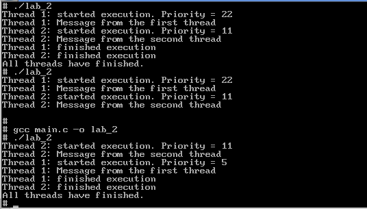

# Лабораторная работа №2

## Описание
Данная лабораторная работа посвящена изучению работы с потоками. Программа демонстрирует создание и управление потоками с использованием различных политик планирования.

## Структура проекта
- `main.c` — основной файл с исходным кодом программы.
- `result.png` — изображение с результатами выполнения программы.

## Требования
- Компилятор C (например, GCC).
- Среда разработки или текстовый редактор для редактирования кода.

## Инструкция по сборке и запуску
1. Скомпилируйте файл `main.c`:
    ```bash
    gcc main.c -o lab2 -lpthread
    ```
2. Запустите скомпилированный файл:
    ```bash
    ./lab2
    ```

## Функционал
Программа выполняет следующие задачи:
- Создает два потока с разными приоритетами и политиками планирования:
  - Первый поток (SCHED_RR) с приоритетом 5 выполняет задачу в течение 5 секунд.
  - Второй поток (SCHED_FIFO) с приоритетом 11 выполняет задачу в течение 10 секунд.
- Каждый поток выводит сообщение о начале и завершении своей работы.
- Основной поток программы ожидает завершения работы обоих потоков.

## Индивидуальное задание (Вариант 9)
В рамках индивидуального задания реализована программа, которая управляет потоками с использованием различных политик планирования (SCHED_RR и SCHED_FIFO).

## Результаты
Результаты выполнения программы представлены на изображении ниже:



## Примечания
- Убедитесь, что все зависимости установлены перед запуском.
- Для корректной работы программы следуйте инструкциям в комментариях кода.

## Автор
I914B Лукин Никита