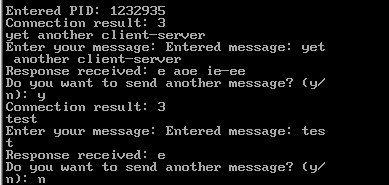

# Лабораторная работа №3: Взаимодействие клиента и сервера

## Описание
Данная лабораторная работа посвящена изучению взаимодействия клиента и сервера. В рамках работы реализована клиент-серверная архитектура, где клиент отправляет запросы, а сервер обрабатывает их и возвращает ответы.


## Индивидуальное задание (Вариант 9)
В рамках индивидуального задания для 9 варианта, сервер возвращает клиенту его же сообщение, исключив из него все согласные буквы.


## Структура проекта
- **`client.c`** — содержит реализацию клиента, который отправляет запросы на сервер.
- **`server.c`** — содержит реализацию сервера, который принимает запросы от клиента и возвращает ответы.
- **`README.md`** — данный файл с описанием лабораторной работы.
- **`client`** — скомпилированный файл клиента.
- **`server`** — скомпилированный файл сервера.

## Результаты
Ниже представлены изображения с результатами выполнения программы:

### Пример работы клиента


### Пример работы сервера


## Как запустить
1. Запустите сервер:  
    ```bash
    server
    ```
2. Запустите клиента в другом терминале:  
    ```bash
    client
    ```

## Выводы
В ходе выполнения лабораторной работы были изучены основы взаимодействия клиента и сервера, а также принципы передачи данных между ними.
