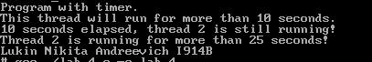

# Лабораторная работа №4: Таймеры и потоки

## Описание
Данная лабораторная работа посвящена изучению работы с таймерами и потоками. Программа демонстрирует использование тайм-аутов для управления потоками.

## Структура проекта
- **`lab_4.c`** — основной файл с исходным кодом программы.
- **`image.png`** — изображение с результатами выполнения программы.

## Требования
- Компилятор C (например, GCC).
- Среда разработки или текстовый редактор для редактирования кода.

## Инструкция по сборке и запуску
1. Скомпилируйте файл `lab_4.c`:
    ```bash
    gcc lab_4.c -o lab4
    ```
2. Запустите скомпилированный файл:
    ```bash
    ./lab4
    ```

## Функционал
Программа выполняет следующие задачи:
- Создает поток, который выполняет задачу в течение 26 секунд.
- Устанавливает тайм-аут на 10 секунд для ожидания завершения потока.
- Если поток не завершился за 10 секунд, выводит сообщение о превышении времени ожидания.
- Повторяет проверку через 5 секунд, чтобы определить, завершился ли поток за 25 секунд.

## Результаты
Результаты выполнения программы представлены на изображении ниже:



## Примечания
- Убедитесь, что все зависимости установлены перед запуском.
- Для корректной работы программы следуйте инструкциям в комментариях кода.

## Автор
I914B Лукин Никита Андреевич