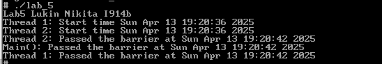

# Лабораторная работа №5: Барьеры и синхронизация потоков

## Описание
Данная лабораторная работа посвящена изучению работы с барьерами и синхронизацией потоков. Программа демонстрирует использование барьеров для координации выполнения нескольких потоков.

## Структура проекта
- **`main.c`** — основной файл с исходным кодом программы.
- **`result.png`** — изображение с результатами выполнения программы.

## Требования
- Компилятор C (например, GCC).
- Среда разработки или текстовый редактор для редактирования кода.

## Инструкция по сборке и запуску
1. Скомпилируйте файл `main.c`:
    ```bash
    gcc main.c -o lab5 -lpthread
    ```
2. Запустите скомпилированный файл:
    ```bash
    ./lab5
    ```

## Функционал
Программа выполняет следующие задачи:
- Создает два потока, которые выполняют свои задачи параллельно.
- Потоки синхронизируются с использованием барьера:
  - Первый поток выполняет задачу в течение 3 секунд, затем ждет на барьере.
  - Второй поток выполняет задачу в течение 6 секунд, затем ждет на барьере.
  - Основной поток также ждет на барьере.
- После того как все потоки достигают барьера, они продолжают выполнение.

## Результаты
Результаты выполнения программы представлены на изображении ниже:



## Примечания
- Убедитесь, что все зависимости установлены перед запуском.
- Для корректной работы программы следуйте инструкциям в комментариях кода.

## Автор
I914B Лукин Никита